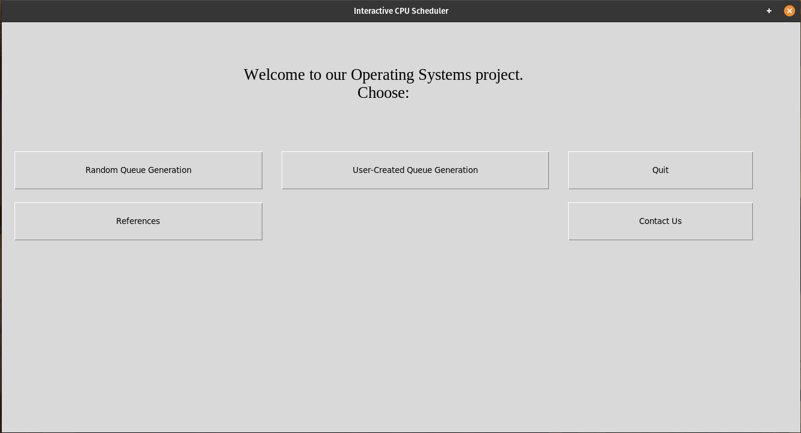

# Interactive CPU Scheduler

This is a GUI application which provides a dynamic and interactive interface to compare and evaluate CPU scheduling algorithms.



### CPU Scheduling Algorithms included:

1.  First Come First Serve (FCFS)
2.  Shortest Job First (SJF)
3.  Shortest Time Remaining First (SRTF) (Pre-emptive SJF)
4.  Priority Queue (Non Pre-emptive)
5.  Priority Queue (Pre-emptive)
6.  Round Robin with a range of time quanta available
7.  Multi-Level Queue with custom levels
8.  Multi-Level Feedback Queue with custom levels
9.  _Also a default algorithm is provided for comparison which is based on general algorithms used in common operating systems._

### Requirements

We recommend using Python 3.7.x for this application as Tkinter comes bundled with Python from 3.7 onwards.

### Instructions

```
git clone https://github.com/aitikgupta/interactive_cpu_scheduler.git
cd interactive_cpu_scheduler
python3 gui.py
```

##### Note: If there's an 'ImportError: No module named tkinter':

Enter the following command (Linux):

```
sudo apt-get install python3-tk
```

### Output Parameters:

1.  Average Waiting Time
2.  Average Response Time
3.  Average Turnaround Time
4.  Throughput

### Contributors:

1.  [Aadit Agarwal](https://github.com/aaditagarwal)
2.  [Aashish B Khatri](https://github.com/aashish-khatri)
3.  [Abhishek Jindal](https://github.com/abhishekjindal09)
4.  [Aitik Gupta](https://github.com/aitikgupta)
5.  [Himanshu Ruhela](https://github.com/verdantfire)
6.  [Madhavik Agarwal](https://github.com/madhavik0512)
